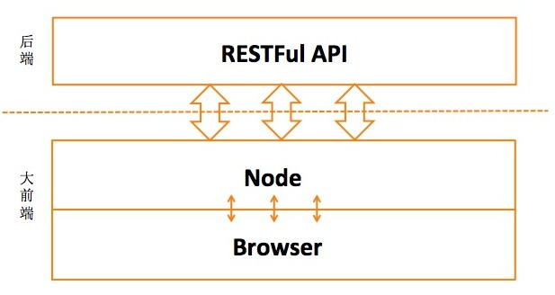
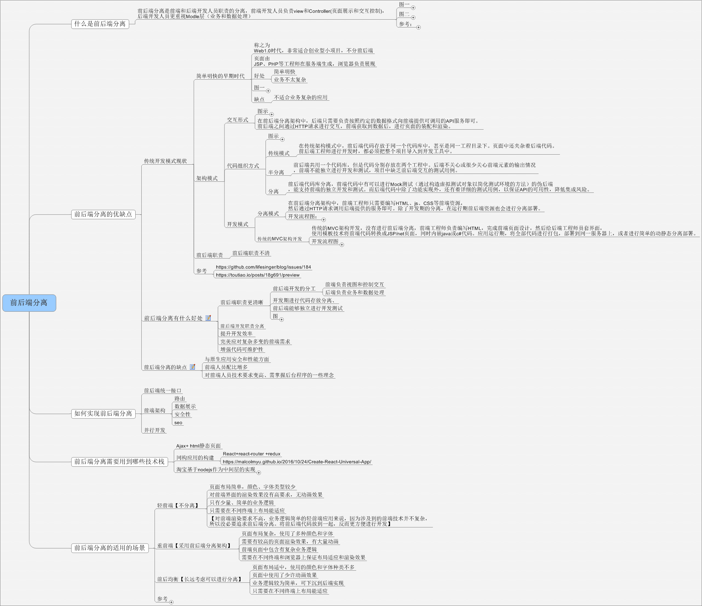
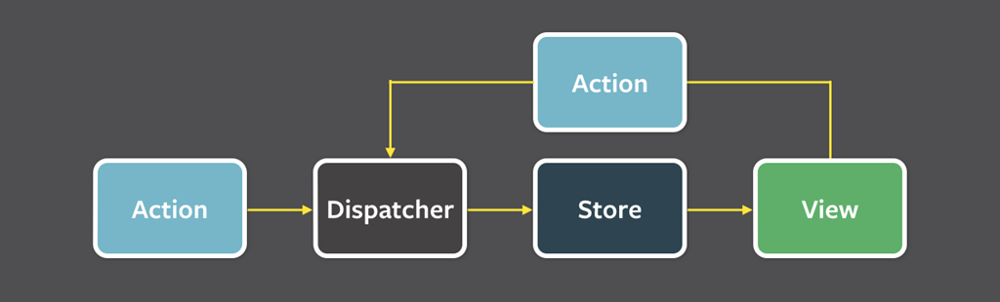
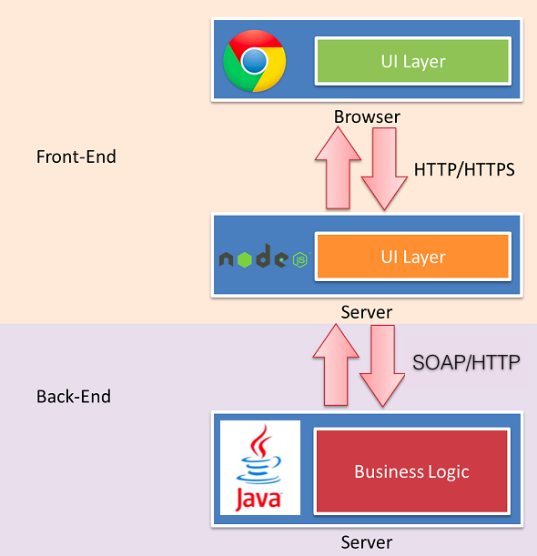

这是06年空降到一个团队做前后端分离的时候临时写的一篇文章，旨在科普和分享。

由于当时的团队大部分成员都没接触过，再加上时间有限，所以写的都是些白话、口水话。

回过头来看一下以前的理解，再看看现在自己的实践，不得不感叹重庆的互联网研发技术体系发展得还是很快的；

回想05年的时候我们顶着多大的压力使用webpack构建react、redux的项目，采用nodejs搭建前端server，后端采用服务化开发，文档资源欠缺，相关的人力资源也欠缺；

再看看现在的重庆，这些都是必备技能啊……

# 前后端分离

web开发中真正意义上的前后端分离是纯粹的以webapi为标准进行前后端隔离；

这样一来，web前端就成为了和android/ios类似的客户端程序:

```
移动客户端/桌面客户端/web前端专注于各自客户端的开发工作，以API为标准进行双向数据通信；

服务端专注于业务逻辑，核心架构，输出以RESTful为标准的webapi;

测试团队分别测试webpai和各个客户端的UI逻辑;
```

用我们通俗易懂的方式来理解：前端全是html，所有数据来源于ajax异步请求webapi。


这样一来是满足了我们的要求，但是呈现出了新的问题
```
全异步了SEO优化怎么办

全异步了首屏渲染会交给客户端，这样大大降低了首屏渲染速度
```

于是，大前端诞生了

我们在前端加入了一层webserver，这一层可以是asp.net/java/node/php等等任何一种可以做web服务端开发的平台



这样一来，前端可以在需要用到服务端渲染的地方自由的使用服务端渲染，需要考虑客户端体验的地方使用客户端渲染

### 然而
聪明的你一定会想：这跟以前有什么区别？仅仅是多了一个webapi层？仅仅为了实现多端(ios/android/web/pc...)统一模式和流程？

对，大架构就是这样，但这还不是最好的

细心的你已经看到了，上图的webserver是node而不是上文说到的asp.net/java/php等等

why?

### 我们先看看用ASP.NET该怎么解决首屏渲染的问题
构建一个ASP.NET的页面，这是一个服务端语言的模板，在这个模板上绑定数据，然后输出到客户端

那么首屏以外的东西呢：js构建其他模板，ajax获取数据，绑定模板数据，渲染绑定后的模板

我们是不是写了两个模板？

如果这是一个滑动加载的列表页，那么这了两个模板是不是一样的？

如果这个列表页重新设计了，我们需要去修改一套服务端语言的模板，一套客户端语言的模板。

我们需要统一！统一模板！统一编程语言！统一编程风格！统一编码规范！统一一切！

### 同构应用
[知乎两年前的前端外刊](https://zhuanlan.zhihu.com/p/19973091?columnSlug=FrontendMagazine)

白话：客户端和服务端用同样的写法，用同样的东西

进阶：大前端没有服务端，这就是一个客户端，想一想ios/android，大前端就是一个客户端，用一门编程语言写出来


# 我们如何操作
同构涉及到的技术栈和知识面相对较广，对现在的前端同事很不友好，
目前不采用，仅供学习和参考。


#####我们需要尽可能低成本的分离


## web前端开发人员对前后端的理解
1.同事A

```
前端：编写运行于浏览器上的程序
后端：编写运行于服务器上的程序
前后端分离：重新划分前后端工作，使前后端技术分离，分工分离，在工程管理中实现解耦。
```

2.同事A
```
让前端不用再依赖后台进度做开发；后台只负责数据的提供和计算，而完全不处理展现。
而前端则负责拿到数据，组织数据并展现的工作。这样结构清晰，关注点分离，前后端会变得相对独立并松耦合
```

3.同事C



## 如何实现
服务端提供webapi

前端采用React做组件视图引擎，React-Router做路由，Redux+react-redux做顶层状态管理。



##### 淘宝前端
[http://developer.51cto.com/art/201404/435984.htm](http://developer.51cto.com/art/201404/435984.htm)

中途岛(Midway Framework)的架构是由淘宝的前端团队在14年4月份提出来的

简单的说，中途岛架构是基于NodeJs的，因为Js是一门前后端通吃的语言，它可以作为一个桥梁搭建在原始的前后端模式中。具体的中途岛思想可以参考淘宝前端团队博客里发的博文：前后端分离的思考与实践想象一下这个场景多么美好：前端来决定某个模板是服务端渲染还是客户端渲染，当首屏的时候，就在nodejs里面生成HTML，不是首屏的时候，就AJAX过来在浏览器端渲染展示。

加入NodeJs还有很多好处，比如NodeJs的高并发特性，请求合并等。同时使用nodeJs做桥梁，前端可以自己决定获取什么格式的数据。



##### 美团前端
[http://tech.meituan.com/node-fullstack-development-practice.html](http://tech.meituan.com/node-fullstack-development-practice.html)
